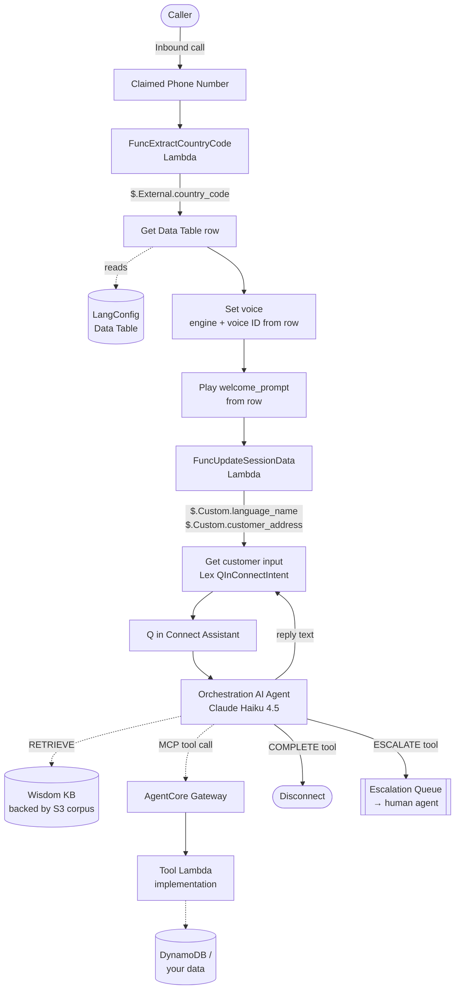

# Agentic Connect Experience

A reusable CDK construct — `ConnectPattern` — for building agentic Amazon Connect experiences with knowledge-base retrieval, MCP tool calling via Bedrock AgentCore Gateways, dynamic multi-language voice, and both inbound and campaign-style outbound flows. This repository contains the construct itself plus a sample stack (`AgenticConnectStack`) that provisions a complete end-to-end demo — an EV charger customer support line — to show how the pieces fit together.

The intent is that consumers of the pattern describe the experience they want as a `ConnectPatternProps` value and get a working Connect instance in one deploy, without hand-wiring Wisdom, Lex, AgentCore, Customer Profiles, Data Tables, and the surrounding IAM and integration-association plumbing.

> Disclaimer: This is sample code intended for demonstration and prototyping. It is not production-ready as-is.

## Table of Contents

- [What the pattern does](#what-the-pattern-does)
- [How a contact flows through the components](#how-a-contact-flows-through-the-components)
- [Highlighted features](#highlighted-features)
  - [Deepgram voice integration](#deepgram-voice-integration)
  - [Multi-language support via Connect Data Tables](#multi-language-support-via-connect-data-tables)
  - [Automatic country-code extraction with fallback](#automatic-country-code-extraction-with-fallback)
  - [Multiple AI agents with knowledge base and MCP tools](#multiple-ai-agents-with-knowledge-base-and-mcp-tools)
- [Repository layout](#repository-layout)
- [Sample stack walkthrough](#sample-stack-walkthrough)
- [Configuration](#configuration)
- [Resources created](#resources-created)
- [Prerequisites](#prerequisites)
- [Deploy](#deploy)
- [Cleanup](#cleanup)
- [License](#license)

## What the pattern does

Provisioning a modern Connect experience today means stitching together a dozen services with subtle dependency ordering, several first-class API objects that CFN doesn't fully model, and a handful of `AwsCustomResource` calls to fill in the gaps. `ConnectPattern` collapses that into a single construct that:

- Provisions the Connect instance, Customer Profiles domain (with rule-based matching), Data Tables, escalation queue, and an inbound phone number.
- Wires Q in Connect (Wisdom): assistant, association to the instance, and per-agent orchestration configurations with prompts and prompt versions.
- Sets up a Lex V2 bot with the `AMAZON.QInConnectIntent` for every configured locale, and manages the build/version/alias lifecycle correctly (so aliases only serve fully-built locales).
- Registers each provided Lambda function as an MCP tool through a dedicated Bedrock AgentCore Gateway, wraps it in an AppIntegrations `MCP_SERVER` application, and associates it with the Connect instance.
- For each agent that requests knowledge-base retrieval, stands up an AppIntegrations `DataIntegration` on the provided S3 bucket, a Wisdom knowledge base, and the assistant association — plus the `Retrieve` tool binding on the orchestration agent.
- Creates a Connect Security Profile per AI agent with `Wisdom.View` and one MCP application permission per registered tool, then associates the profile with the AI agent (which the underlying CFN types don't natively support).
- Injects two operational Lambdas that every Connect contact flow uses: a session-data updater (populates the Q in Connect `$.Custom.*` variables the orchestration prompts reference) and a country-code extractor (used to look up the caller's `LangConfig` row and drive dynamic language routing).
- Optionally provisions a Secrets Manager–backed Deepgram API key with the KMS and resource policy grants required by both Lex and Connect.
- Optionally creates a Connect admin user with a password sourced from a `SecretValue`.

Everything is opt-in — the pattern only creates what the props ask for.

## How a contact flows through the components

The diagram below traces a single inbound contact through the resources the pattern provisions. Solid arrows are the linear flow the caller experiences; dotted arrows are asynchronous or lookup interactions. `RETRIEVE` and MCP tool invocations happen from inside the orchestration turn — the agent is free to call them zero, one, or many times before producing a reply.



The interaction loop between `Get customer input`, the Q in Connect assistant, and the orchestration agent runs once per customer utterance and keeps looping until the agent invokes one of the two `RETURN_TO_CONTROL` tools (`COMPLETE` or `ESCALATE`) that hand control back to the contact flow.

For outbound flows the top of the diagram is different — the `FuncStartOutboundCall` Lambda calls `StartOutboundVoiceContact` to place the call, and the country-code extractor reads the destination number rather than the caller number — but everything from `Set voice` downwards is identical.

## Highlighted features

### Deepgram voice integration

Setting `voice_provider='deepgram'` on `ConnectPatternProps` provisions a Secrets Manager secret encrypted with a KMS key, and grants Lex and Connect the ability to decrypt and read it. The secret is created empty; put your Deepgram API key in it after the first deploy — the ARN is exported via a stack output (`DeepgramSecretArn`).

Contact flows read Deepgram-specific voice parameters (`deepgram_voice` per language, `deepgram:aura-2` engine, external credential ARN) from the Data Table row corresponding to the caller's country code, so the voice used to speak to each caller is chosen at contact time from the customer's language configuration.

The alternative provider is `amazon`, which maps the same Data Table columns to Polly Neural voices with per-language engine and style overrides.

### Multi-language support via Connect Data Tables

Language configuration lives in Connect Data Tables — one row per country code, each row carrying the language name, language code, TTS voice IDs (Deepgram and Amazon), welcome prompt, and error message. The sample stack ships two rows:

The two rows shipped with the sample stack look like this once loaded into the `CustomerSupportDataTable`:

| Attribute | `+34` (Spain) | `+1` (US / Canada / NANP) |
|---|---|---|
| `language_code` | `es-ES` | `en-US` |
| `language_name` | Spanish | English |
| `deepgram_voice` | `nestor` | `arcas` |
| `amazon_voice` | `Sergio` | `Matthew` |
| `amazon_speaking_engine` | `Neural` | `Neural` |
| `amazon_speaking_style` | `None` | `Conversational` |
| `welcome_prompt` | Bienvenido, ¿en qué podemos ayudarle? | Welcome, how can we help you? |
| `error_message` | Estamos experimentando un problema técnico. Le devolveremos la llamada en breve. | We're currently experiencing a technical issue. We'll call you back shortly. |

The row is described in `assets/connect/customer_support_data_table_definition.json` as a plain dict keyed by country code, and the pattern turns each key into a `CfnDataTableRecord` with `country_code` as the primary attribute.

At contact time the flow reads the row keyed by the caller's country code and drives every language-dependent behavior from those columns: TTS voice/engine, spoken prompts, and the `language_name` value injected into the Q in Connect prompt as `$.Custom.language_name`. Adding a new language means adding a row to the table definition — no changes to the contact flow, the pattern, or the orchestration prompt.

The pattern accepts multiple Data Tables. The sample uses two — one for customer support, one for the technician-visit flow — so each experience can carry its own language-scoped configuration without cross-contamination.

### Automatic country-code extraction with fallback

Every deploy provisions a Python Lambda (`FuncExtractCountryCode`) that:

1. Reads the caller's E.164 address from `event.Details.ContactData.CustomerEndpoint.Address`.
2. Parses it with the `phonenumbers` library and extracts the country calling code.
3. Verifies the code is one of the supported values — computed at synth time as the union of all country-code keys across every configured Data Table.
4. Returns the code as `country_code` for the contact flow to consume via `$.External.country_code`.
5. Falls back to a configurable default (`country_code_detection_fallback` on the props) whenever the number is missing, unparseable, invalid, or maps to an unsupported country.

The flow uses this to look up the `LangConfig` row and populate every language-dependent variable in a single Data Table read. The fallback guarantees the flow always has a valid row to read, even for spoofed caller IDs, chat-channel contacts without a phone address, or campaign contacts with badly-formatted destinations.

### Multiple AI agents with knowledge base and MCP tools

The pattern accepts a list of `Agent` props, each describing an orchestration AI agent with its own prompt and its own set of tools. Two tool sources are supported and can be combined on the same agent:

**Knowledge base retrieval.** Passing an S3 bucket as `retrieve_tool_target` on an agent creates an AppIntegrations `DataIntegration` on the bucket, a Wisdom knowledge base backed by the integration, and an assistant association. The pattern then registers the built-in `aws_service__qconnect_Retrieve` MCP tool on the orchestration agent, binding it to the assistant-association ID via a `JsonPath` override — which is the actual CFN-native path for wiring a KB into an orchestration agent (rather than the association-configuration path used by self-service agents).

**Lambda-backed MCP tools.** Each entry in `mcp_tools` on an agent gets:

- A dedicated Bedrock AgentCore Gateway with a custom JWT authorizer bound to the Connect instance's discovery URL.
- A `for_lambda` gateway target with the caller-provided tool schema.
- A post-deploy Lambda custom resource that patches the gateway's `allowed_audience` to reference its own freshly-minted gateway ID (breaking the CDK circular reference that would otherwise make this un-synthesizable).
- An AppIntegrations `MCP_SERVER` application wrapping the gateway URL, tagged `AmazonConnectEnabled=true`.
- A Connect `APPLICATION` integration association linking the application to the Connect instance.
- A Connect Security Profile per AI agent, with `Wisdom.View` for the built-in retrieve tool and one namespace-scoped `MCP` application permission per registered MCP tool.
- A `Connect.associateSecurityProfiles` custom resource call that binds the security profile to the AI agent's ARN.

The sample stack demonstrates both patterns:

- `CustomerSupportAgent` uses only knowledge-base retrieval — an S3 bucket populated with 24 short KB articles on EV charger topics (installation, connectivity, error codes, account management).
- `TechnicianVisitAgent` uses only an MCP tool — a Lambda function backed by DynamoDB that records the customer's chosen technician-visit availability windows and is exposed to the agent as `UPDATE_TECHNICIAN_VISIT`.

Nothing prevents an agent from combining both.

## Repository layout

```
├── app.py                              CDK app entry point
├── stacks/
│   └── connect_stack.py                Sample stack using ConnectPattern
├── connect_pattern/                    The reusable construct
│   ├── construct.py                    ConnectPattern class
│   ├── props.py                        ConnectPatternProps dataclasses
│   └── assets/                         Lambdas shipped with the construct
│       ├── func_extract_country_code/
│       ├── func_update_session_data/
│       ├── func_create_admin/
│       ├── func_gateway_audience_updater/
│       └── lex_bot_build/
└── assets/                             Sample stack's own assets
    ├── connect/
    │   ├── contact_flow.json           Templated flow shared by both experiences
    │   ├── customer_support_prompt.yaml
    │   ├── technician_visit_prompt.yaml
    │   ├── technician_visit_tool_schema.json
    │   └── *_data_table_definition.json  Per-experience LangConfig rows
    ├── customer_support_docs/          24 KB articles ingested into Wisdom
    └── _lambda/
        ├── func_update_technician_visit/  MCP tool implementation
        └── func_start_outbound_call/      Triggers the outbound flow
```

## Sample stack walkthrough

`AgenticConnectStack` provisions an EV charger contact center with two experiences:

- **Customer support** (inbound). The claimed phone number is associated with a `CustomerSupport` contact flow that classifies the caller's country code, loads the language row, greets in the caller's language, and routes to the `CustomerSupportAgent` orchestration agent. The agent uses the Wisdom knowledge base built from `assets/customer_support_docs` to answer questions about the charger, the mobile app, error codes, warranty, and so on. `RETRIEVE`, `ESCALATE`, and `COMPLETE` tools are available on the agent.
- **Technician visit** (outbound). A `FuncStartOutboundCall` Lambda triggers a `StartOutboundVoiceContact` into the `TechnicianVisit` flow with a customer phone number. The flow greets the customer and hands off to `TechnicianVisitAgent`, which collects the customer's preferred availability windows and records them via the `UPDATE_TECHNICIAN_VISIT` MCP tool (a Lambda that writes to a DynamoDB table).

Both experiences share the same templated `contact_flow.json`, parametrized at synth time via placeholder substitution (`${WISDOM_ASSISTANT_ARN}`, `${AI_AGENT_VERSION_ARN}`, `${DATA_TABLE_ID}`, and so on).

## Configuration

`ConnectPatternProps` is a dataclass with the following top-level fields (all defined in `connect_pattern/props.py`):

| Field | Required | Purpose |
|---|---|---|
| `instance` | yes | Instance alias, optional pre-existing ARN, Customer Profiles rule-based matching config, Connect attributes |
| `lex_bot` | yes | Name, locales, optional SLR creation for `lexv2.amazonaws.com` |
| `country_code_detection_fallback` | yes | E.164 code the extractor Lambda returns when parsing fails |
| `data_tables` | yes (has default) | List of `DataTable`s keyed by country code |
| `voice_provider` | no (`amazon` default) | `amazon` or `deepgram` |
| `phone_number` | no | Country code and phone type to claim |
| `escalation_queue` | no | Time zone plus hours-of-operation config |
| `admin_user` | no | Username and `SecretValue` password |
| `agents` | no | List of `Agent`s |

Each `Agent` carries a `name`, an `ORCHESTRATION` `Prompt` (name, model ID, template text), an optional S3 bucket as `retrieve_tool_target`, and a list of `McpTool`s (each combining a Lambda function, an AgentCore tool schema, and a tool name).

A minimal single-language, single-agent setup looks like:

```python
ConnectPattern(
    self, "ConnectPattern",
    ConnectPatternProps(
        voice_provider="deepgram",
        country_code_detection_fallback="+1",
        instance=ConnectPatternProps.Instance(alias="my-contact-center"),
        lex_bot=ConnectPatternProps.LexBot(name="MyBot", locales=["en_US"]),
        phone_number=ConnectPatternProps.PhoneNumber(country_code="US"),
        agents=[
            ConnectPatternProps.Agent(
                name="Support",
                retrieve_tool_target=my_kb_bucket,
                prompt=ConnectPatternProps.Prompt(
                    name="SupportPrompt",
                    model_id="us.anthropic.claude-haiku-4-5-20251001-v1:0",
                    text=Path("assets/support_prompt.yaml").read_text(),
                ),
            ),
        ],
    ),
)
```

Every prop above except `voice_provider`, `country_code_detection_fallback`, `instance`, and `lex_bot` is optional; omit them and the corresponding resources are not created. Data Tables default to a single English row if not supplied. See `stacks/connect_stack.py` for a full-featured example exercising every prop.

## Resources created

Deploying the sample stack materializes roughly the following (some via native L1 constructs, some via `AwsCustomResource` calls where CFN coverage is missing):

- 1 Connect instance, 1 Customer Profiles domain (rule-based matching enabled), 1 claimed phone number, 1 escalation queue with hours of operation
- 2 Connect Data Tables (customer support, technician visit) with per-country language rows
- 1 Lex V2 bot with 2 locales (`en_US`, `es_ES`), 1 bot version, 1 alias
- 1 Wisdom assistant, 1 knowledge base with S3 data integration, 1 assistant–KB association, 1 assistant–instance integration association
- 2 orchestration AI agents, each with prompt and prompt version
- 1 AgentCore Gateway with a Lambda target (for the technician-visit agent)
- 1 AppIntegrations `MCP_SERVER` application, 1 Connect `APPLICATION` integration association
- 2 Connect Security Profiles (one per AI agent), each associated with its agent via `Connect.associateSecurityProfiles`
- 1 Deepgram Secrets Manager secret with dedicated KMS key
- Operational Lambdas: session-data updater, country-code extractor, gateway-audience updater, Lex-build waiter (on_event + is_complete), admin user handler, technician-visit updater, outbound-call starter
- 2 contact flows (customer support inbound, technician visit outbound)
- 1 S3 bucket for the KB corpus (with 24 uploaded documents), 1 DynamoDB table for technician-visit records

## Prerequisites

- Python 3.14
- AWS CDK v2 (v2.244.0 or later)
- An AWS account with Connect enabled in `us-east-1` and Bedrock model access to `us.anthropic.claude-haiku-4-5-20251001-v1:0` (or whichever model ID you configure on the agents)
- The `AWSServiceRoleForLexV2Bots_AmazonConnect_<account>` service-linked role. Set `lex_bot.create_service_linked_role=True` on the first deploy in an account to have the pattern create it, then set it back to `False` for subsequent deploys or stacks (the role is account-scoped and only one can exist).
- The `AWSServiceRoleForAmazonConnect_*` and `AWSServiceRoleForAmazonQConnect` service-linked roles, which Connect creates on demand.

## Deploy

```bash
python -m venv .venv
source .venv/bin/activate
pip install -r requirements.txt

# On first deploy, if the LexV2Bots SLR doesn't already exist in the account,
# temporarily flip lex_bot.create_service_linked_role=True in connect_stack.py.

cdk deploy AgenticConnectStack \
    --parameters ConnectAdminPassword=<your-admin-password>
```

After the stack settles, populate the Deepgram secret if using `voice_provider='deepgram'`:

```bash
aws secretsmanager put-secret-value \
    --secret-id <DeepgramSecretArn from stack output> \
    --secret-string '{"apiToken": "your-deepgram-api-key-here"}'
```

Finally, enable Lex Bot Management in the Connect console: open your instance → **Flows** → under *Lex bots configuration*, tick **Enable Lex Bot Management in Amazon Connect** → **Save**.

Then dial the claimed number to hit the customer support flow, or invoke the outbound-call Lambda with a `{"customer_phone": "+..."}` payload to trigger the technician-visit flow.

## Cleanup

`cdk destroy AgenticConnectStack` will tear down all resources. A few things to be aware of:

- The Deepgram secret and its KMS key are configured with `RemovalPolicy.RETAIN` — they persist across stack deletes so an accidentally-deleted stack doesn't take an API key with it. Delete them manually via the console or CLI if you want them gone.
- The Lex V2 SLR is not destroyed (it's account-scoped and shared).
- If a stack delete gets stuck on a Security Profile "in use" error, the AI agent hasn't finished tearing down its version-qualified associations yet — retry the delete after a minute, or delete the affected AI agent directly via `aws qconnect delete-ai-agent`.

## License

See [`LICENSE.txt`](LICENSE.txt).